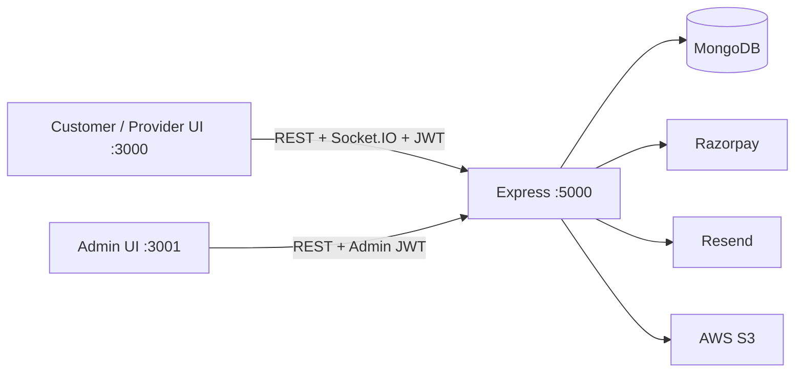

# ShareWork

Fixed-price marketplace. A customer chats with a provider, they lock a written agreement, the customer funds escrow, the provider delivers, and payment releases after customer approval or an authorized admin action.

This workspace contains **three applications**. Express is the only business backend.

## Overview

| App | Folder | Port | Role |
|---|---|---|---|
| Customer + Provider UI | `ShareWork-Customer&Provider` | 3000 | Hire and work in one Next.js (TypeScript) app |
| Admin UI | `sharework-admin` | 3001 | Moderation console (Next.js, JavaScript) |
| Backend API | `sharework-backend` | 5000 | Auth, data, chat, files, payments, admin |

Live frontends call Express at `http://localhost:5000` (override with `NEXT_PUBLIC_API_BASE_URL`). They do not use Next.js `src/app/api` for live business logic.

## Architecture

```
Customer/Provider UI (:3000)  --REST + Socket.IO + JWT-->  Express (:5000)  -->  MongoDB
Admin UI (:3001)              --REST + Admin JWT-------->  Express (:5000)  -->  MongoDB
```

External integrations (implemented, **configuration-dependent**; live delivery is not claimed here):

- **Razorpay** — order create and signature verify on the backend
- **Resend** — OTP and password-reset email
- **AWS S3** — stored files (portfolio, chat attachments, deliverables)

### Customer + Provider

Next.js 16 (App Router) + React 19 + TypeScript. After login the UI is a client SPA (`ShareWorkSpa`). REST and Socket.IO talk to Express.

### Admin

Next.js 16 + JavaScript. REST only. Admin JWT (`role=admin`). Separate app from the customer/provider UI.

### Backend

Express. Shape: **route → middleware (JWT / role / Zod) → controller → service → Mongoose model**.

### Database

MongoDB. Local default: `mongodb://127.0.0.1:27017/sharework`.

### Authentication

Stateless JWT access token + refresh token. Header: `Authorization: Bearer <token>`. Roles: `customer`, `provider`, `admin`. Public signup cannot create admin.

### Realtime

Socket.IO on the same HTTP server as Express. JWT required to connect. REST remains source of truth for messages and money.



HTML/spec files under `reference/` are **reference only**. Some of that material describes NestJS, PostgreSQL/Supabase, wallets, or WebRTC. Those are **not** the running stack. If they conflict with this repo, the Express + Mongo + JWT + Socket.IO code wins.

## Repository Structure

```
ShareWork-Customer&Provider/   Customer + Provider Next.js UI
sharework-admin/               Admin Next.js UI
sharework-backend/             Express API, Socket.IO, tests, seed
reference/                     Spec HTML and architecture images (not runtime)
```

Important backend files:

- `sharework-backend/src/server.js` — HTTP + Socket.IO start
- `sharework-backend/src/routes/` — route groups
- `sharework-backend/src/middlewares/auth.js` — JWT
- `sharework-backend/src/sockets/chat.socket.js` — realtime
- `sharework-backend/src/services/payment.service.js` — Razorpay
- `sharework-backend/src/services/escrow.service.js` — lock / release / refund / split
- `sharework-backend/src/services/mail.service.js` — Resend
- `sharework-backend/src/services/storage.service.js` — S3
- `sharework-backend/src/scripts/seed.js` — local users

Important frontend files:

- `ShareWork-Customer&Provider/src/lib/api.ts` — Express client
- `ShareWork-Customer&Provider/src/lib/socket.ts` — Socket.IO client
- `ShareWork-Customer&Provider/src/lib/payments.ts` — checkout + verify
- `sharework-admin/lib/api.js` — Express client

## User Roles

### Customer

Discover providers (including category filter), start chats, approve or reject agreements, fund escrow, request revisions, approve delivery, review, open disputes, post requirements, read notifications.

### Provider

Publish gigs (with optional portfolio images), chat, create agreements, submit deliverables, read earnings, request withdrawals (pending records), set availability, read notifications.

### Admin

Dashboard, users (ban/unban), projects, escrow/transactions, force-release, leakage logs, disputes (refund or 50/50 split), **category CRUD**, notifications inbox, fee/GST/maintenance settings. Separate app.

## Complete Business Flow

1. Customer discovers a provider and opens the profile.
2. Customer starts a conversation (optionally from a gig).
3. They chat (REST + Socket.IO). Anti-leakage masks phone/email/UPI/links.
4. Provider creates a fixed-price agreement.
5. Customer approves. Backend creates the project (`agreement_pending`).
6. Customer funds escrow via Razorpay. Backend verifies and **locks** escrow. Project moves to `in_progress`.
7. Provider submits a deliverable.
8. Customer requests revision or approves.
9. On approval, escrow **releases**. Provider earnings update from completed `escrow_release` transactions.
10. Provider may request a withdrawal. That stores a **pending** transaction. It does not transfer money.

### Dispute and escrow actions

- Participant opens `POST /api/projects/:id/dispute`.
- Admin lists `GET /api/admin/disputes` and resolves with `POST /api/admin/disputes/:id/resolve`.
- `refund: true` refunds locked escrow once (Razorpay refund call is environment-dependent).
- `split: true` splits locked escrow 50/50 (cannot combine with `refund: true`).
- `refund: false` and `split: false` closes the dispute without moving money.
- Admin `POST /api/admin/projects/:id/force-release` releases locked escrow without the delivered check. Repeat calls are idempotent (`alreadyProcessed`).
- Duplicate lock/release/refund/split is protected in the escrow service. Amounts are validated server-side.

Delivery without escrow lock is still allowed for older compatibility. Intended path: agreement → fund → lock → deliver → approve → release.

## Categories

Categories are **database-backed**, not constants.

- Public list: `GET /api/categories` (active categories).
- Admin list/create/update/delete: `/api/admin/categories`.
- Customer/Provider discovery, gigs, and requirements use that list.
- Seeded system names (`UI/UX`, `Web`, `App`, `Figma`, `IT`) cannot be deleted.

## Notifications

Authenticated inbox on Express:

- `GET /api/notifications`
- `GET /api/notifications/unread-count`
- `PATCH /api/notifications/:id/read`
- `PATCH /api/notifications/read-all`

The caller only sees their own rows. Customer/Provider show an inbox in the app shell. Admin has a Notifications page. There is no push/email notification channel beyond the in-app API.

## Chat

- REST persists messages: `POST /api/conversations/:id/messages`.
- Socket.IO emits `new_message` to the room. If the socket drops, REST still works.
- Participants only. JWT required.
- Optional file attachment on send (multipart). Download via `GET /api/files/:id` with participant authorization. Upload/download need valid S3 configuration to succeed against AWS; that live path is not claimed verified here.

## Files / S3

Implemented kinds: `portfolio`, `attachment`, `deliverable`. Metadata is stored in Mongo (`StoredFile`). Bytes go to S3 when AWS credentials and bucket are valid.

- Portfolio images on gig create/update (provider).
- Chat attachments on message send.
- Deliverable files on project delivery.
- `GET /api/files/:id` — portfolio is public; deliverables and attachments require a participant JWT.

Placeholder or invalid AWS keys fail at the provider. Software authorization is covered in backend tests; live S3 is configuration-dependent.

## Local Development

Startup order:

1. MongoDB
2. Backend
3. Customer/Provider
4. Admin

### 1. MongoDB

Run MongoDB locally so `mongodb://127.0.0.1:27017/sharework` works. Optional: from `sharework-backend`, `docker compose up mongodb`.

### 2. Backend

```bash
cd sharework-backend
cp .env.example .env
npm install
npm run seed
npm run dev
```

On Windows: `copy .env.example .env`. Replace placeholders in `.env`. Do not commit `.env`.

Health: `GET http://localhost:5000/health` → `200` and `db: "connected"`.

### 3. Customer / Provider

There is **no** frontend `.env.example` in this repository. The app defaults `NEXT_PUBLIC_API_BASE_URL` to `http://localhost:5000`. Create `.env.local` only if the backend is not on that origin.

```bash
cd ShareWork-Customer&Provider
```

PowerShell (folder name contains `&`):

```powershell
Set-Location -LiteralPath 'ShareWork-Customer&Provider'
```

```bash
npm install
npm run dev
```

Optional `.env.local`:

```
NEXT_PUBLIC_API_BASE_URL=http://localhost:5000
```

Open http://localhost:3000.

### 4. Admin

There is **no** Admin `.env.example`. Same default API origin as the customer app.

```bash
cd sharework-admin
npm install
npm run dev
```

Optional `.env.local` with `NEXT_PUBLIC_API_BASE_URL=http://localhost:5000`. Open http://localhost:3001.

## Environment Variables

### Backend (see `sharework-backend/.env.example`)

| Variable | Purpose |
|---|---|
| `PORT` | HTTP port. Must match frontend `NEXT_PUBLIC_API_BASE_URL` |
| `NODE_ENV` | `development`, `test`, or `production`. `test` skips OTP email send |
| `MONGODB_URI` | Mongo connection string |
| `JWT_SECRET` / `JWT_EXPIRES_IN` | Access token |
| `JWT_REFRESH_SECRET` / `JWT_REFRESH_EXPIRES_IN` | Refresh token |
| `CLIENT_URL` | Validated, unused at runtime |
| `CORS_ORIGIN` | Comma-separated browser origins (`http://localhost:3000,http://localhost:3001`) |
| `RAZORPAY_KEY_ID` | Public key id (safe to send to checkout) |
| `RAZORPAY_KEY_SECRET` | Server-only. Checkout HMAC |
| `RAZORPAY_WEBHOOK_SECRET` | Server-only. Webhook HMAC |
| `PLATFORM_FEE_PERCENT` / `GST_ON_FEE_PERCENT` | Default fees |
| `AWS_*` | S3 bucket, region, access keys |
| `RESEND_API_KEY` / `RESEND_FROM` | Outbound OTP mail. `RESEND_FROM` is required for a live send (`MAIL_FROM` / `EMAIL_FROM` aliases) |
| `OTP_EXPIRY_MIN` | OTP lifetime minutes |
| `BCRYPT_SALT_ROUNDS` | Password hashing |
| `DEV_OTP` | Non-production only. Rejected in production |

Never put real secrets in README or `.env.example`. Production rejects placeholder secrets and `DEV_OTP`.

Mail uses **Resend**, not SMTP/nodemailer. Live mailbox delivery requires a valid API key and verified sender. It is not claimed verified in this README.

### Frontends

`NEXT_PUBLIC_API_BASE_URL` must point at the running Express origin. Default in both frontends is `http://localhost:5000`. If backend `PORT` differs, set this variable. Do not change secret values to fix a port mismatch.

## Development Credentials

From `npm run seed` in `sharework-backend` (refuses `NODE_ENV=production`):

| Role | Email | Password |
|---|---|---|
| customer | `customer@sharework.dev` | `ShareWorkDev1!` |
| provider | `provider@sharework.dev` | `ShareWorkDev1!` |
| admin | `admin@sharework.dev` | `ShareWorkDev1!` |

Local development only.

Verified customer/provider seed logins issue tokens. Verified admin login returns `requiresOtp` until `POST /api/auth/verify-otp`.

## Ports

- Backend: **5000**
- Customer/Provider: **3000**
- Admin: **3001**

## API Overview

| Group | What it does |
|---|---|
| `GET /health` | Readiness; 503 if Mongo is down |
| `/api/auth` | signup, login, verify-otp, refresh, password reset |
| `/api/users` | `GET/PUT /me`, public profile |
| `/api/customers/discover` | Customer discovery |
| `/api/providers/:id/gigs` | Public gigs for a provider |
| `/api/gigs` | Provider create/update; GET by id |
| `/api/conversations` | Threads, messages, agreements |
| `/api/projects` | List/detail, fund, deliver, revise, approve, dispute, review |
| `/api/payments` | `create-order`, `verify-checkout`, webhook `verify` |
| `/api/transactions/me` | Own transactions |
| `/api/escrow/release` | Customer release |
| `/api/provider` | stats, earnings, availability, withdraw |
| `/api/customer/requirements` | Customer briefs |
| `/api/categories` | Public active categories |
| `/api/files/:id` | Stored file download |
| `/api/notifications` | Own inbox, unread count, mark read |
| `/api/admin` | stats, users, projects, escrows, leakage, disputes, categories CRUD, settings, audit-logs API, force-release |

Browsable docs on a running backend: `GET /api-docs` and `GET /openapi.json`.

## Authentication

JWT Bearer on protected HTTP routes. Admin routes also require `role=admin`. Socket.IO uses the same access token (`auth.token`). Missing or invalid JWT → 401. Wrong role → 403. Banned user → 403.

Logout is client-side token disposal. There is no server blacklist.

Password reset: `POST /api/auth/forgot-password` then `POST /api/auth/reset-password` (email OTP). Both frontends have a reset UI.

## Agreements

`POST /api/conversations/:id/agreement` — provider only.  
`POST .../agreement/:agreementId/approve` or `/reject` — customer only.

## Projects

Created when a customer approves an agreement. Status moves through agreement, funding, delivery, completion, or dispute. Participants only.

## Payments

**Software path (verified in backend tests):** order validation, role checks, 502 when Razorpay is unavailable, checkout HMAC, webhook HMAC, idempotent lock.

**External live checkout:** needs real Razorpay test/live keys in backend `.env`. Placeholder keys do not create cloud orders. This README does not claim a live Checkout session was verified.

## Escrow

Fund (verified payment) → lock → deliver → customer approve → release. Duplicate webhooks do not double-lock. Admin force-release and dispute refund/split are additional money paths. Tests persist those transitions against Mongo.

## Provider Earnings

`GET /api/provider/earnings` totals come from Mongo transactions (`total`, `pending`, `withdrawn`). The UI may derive available as `total - withdrawn`. No invented wallet.

## Withdrawals

`POST /api/provider/withdraw` creates a pending `withdrawal` transaction. **No bank/UPI payout.** UI copy states funds are not transferred.

## Admin

Live lists from Express. Ban/unban, category CRUD, dispute resolve (refund or 50/50 split), and force-release mutate through the API. `GET /api/admin/audit-logs` exists; there is **no** Admin audit-log page. Settings persist fee/GST/maintenance.

## Testing

There is no root `npm test`. Suites are Node scripts. From `sharework-backend`:

```bash
node tests/auth/run.js
node tests/users/run.js
node tests/requirements/run.js
node tests/gigs/run.js
node tests/projects/run.js
node tests/conversations/run.js
node tests/provider/run.js
node tests/hardening/run.js
node tests/closure/run.js
node tests/models/run.js
node tests/escrow/run.js
node tests/payments/run.js
node tests/admin/run.js
node tests/finance/run.js
node tests/notifications/run.js
node tests/docs/run.js
```

These hit the Mongo URI from backend `.env` and delete records they create. Payment/S3 suites mock or stub the external provider; they do not prove live Razorpay/S3/Resend.

Frontend password-reset scripts (against a running API):

```bash
node tests/password-reset.run.mjs
```

in `ShareWork-Customer&Provider` and `sharework-admin`. Neither frontend has an `npm test` script.

Health:

```bash
curl http://localhost:5000/health
```

Admin production build: `npm run build` in `sharework-admin`.

Customer/Provider: `npm run dev` is the supported local path. `npm run build` currently fails on Next.js 16 prerender of `/auth` (`InvariantError: Expected workStore to be initialized`). Do not treat that production build as passing until it is fixed. On Windows, `npm run lint` in this folder can fail because the directory name contains `&`; run ESLint via a quoted path if needed.

PowerShell: use `-LiteralPath` for `ShareWork-Customer&Provider`.

## Troubleshooting

| Symptom | Check |
|---|---|
| Frontend 401 loop | Backend JWT secret changed; log in again |
| CORS errors | `CORS_ORIGIN` includes both `:3000` and `:3001` |
| `create-order` 502 | Placeholder Razorpay keys; expected locally |
| Socket `Authentication required` | Missing Bearer/auth.token |
| Port in use | Stop the stale Node process on 5000/3000/3001 |
| Mongo disconnected | Start Mongo; health will be 503 until it connects |
| PowerShell `cd` fails | Folder name has `&`; use `Set-Location -LiteralPath` |
| Nodemon stuck “restarting” | Kill the process bound to 5000, then `npm run dev` |
| Admin login 403 | User role is not `admin`; run `npm run seed` |
| OTP email never arrives | Need `RESEND_API_KEY` + `RESEND_FROM`. `NODE_ENV=test` skips send. `@example.com` addresses skip send |
| File upload fails | AWS keys/bucket must be valid; placeholder keys will not store objects |

## Security Notes

- Never commit `.env` / `.env.local`
- Never expose `RAZORPAY_KEY_SECRET`, webhook secret, JWT secrets, or Mongo URIs
- Only `RAZORPAY_KEY_ID` is client-safe
- Production must use long random JWT secrets; refresh secret must differ from access secret
- Webhook route uses raw body for HMAC

## External Services

| Service | Implementation | Live verification |
|---|---|---|
| MongoDB | Required | Local health/tests |
| Razorpay | Order + HMAC verify | Needs real keys. Placeholder → 502. Not claimed live-verified here |
| AWS S3 | Upload/download via SDK | Needs valid keys/bucket. Not claimed live-verified here |
| Resend | OTP / reset email | Needs `RESEND_API_KEY` and `RESEND_FROM`. Not claimed live-verified here |

## Current Limitations

- Live Razorpay Checkout, Resend mailbox delivery, and S3 object I/O are configuration-dependent and not documented as verified
- Withdrawals are pending records; no payout provider
- Admin settings are fee/GST/maintenance only
- No 72-hour auto-release job (Admin UI notice is copy only)
- Admin audit-log API has no UI page
- Frozen Next `src/app/api/**` still on disk in the customer app; unused by live UI
- Customer/Provider `next build` currently fails (Next.js prerender on `/auth`)
- `xss-clean` is deprecated and still used on the backend

## Team Development Guidelines

- Keep Express as the canonical backend
- Do not add live Next.js duplicate APIs
- Keep role checks and money logic on the server
- Frontends are consumers
- Add a backend test when behavior changes
- Never commit secrets
- Do not introduce a second auth system, database, or payment provider

## Handoff Checklist

- [ ] MongoDB running
- [ ] Backend running on 5000 (`GET /health` 200)
- [ ] `npm run seed` (non-production)
- [ ] Customer/Provider running on 3000
- [ ] Admin running on 3001
- [ ] Backend `.env` configured (placeholders only in git)
- [ ] Frontends use `NEXT_PUBLIC_API_BASE_URL` if PORT is not 5000
- [ ] Customer and provider login work
- [ ] Chat + agreement + project lifecycle work
- [ ] Payment/S3/email configuration understood (local fail vs real keys)
- [ ] Admin dashboard loads live data
- [ ] Backend test suites passing

App-level detail: `ShareWork-Customer&Provider/README.md`, `sharework-admin/README.md`, `sharework-backend/README.md`.
